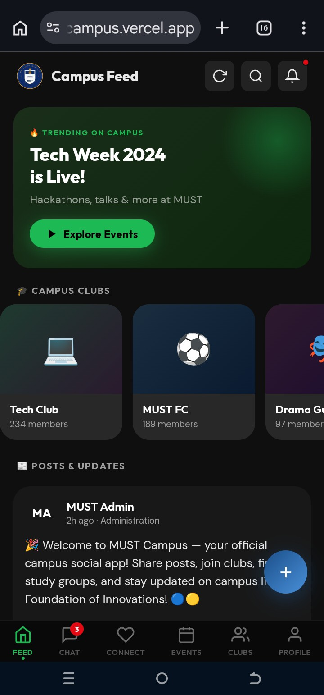
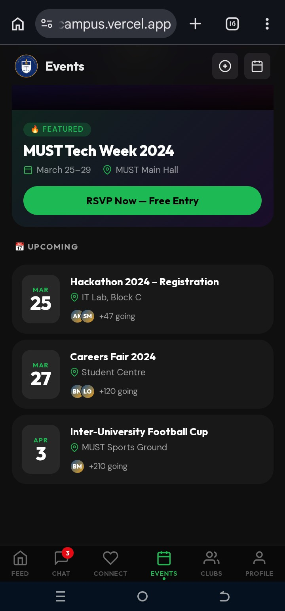
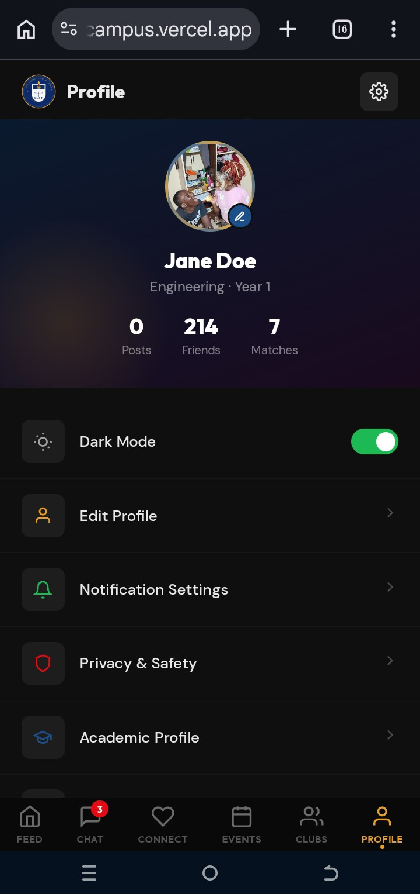
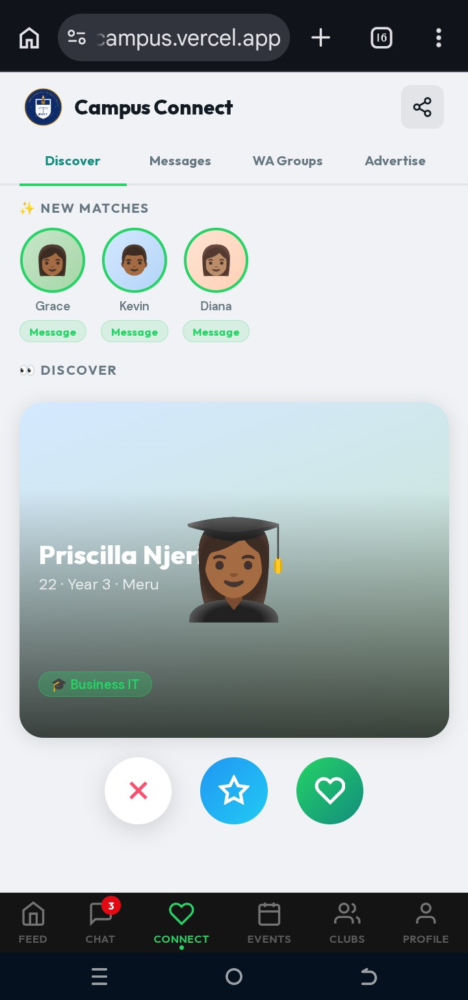

# MUST Campus

> Your campus life, all in one place — Meru University of Science & Technology

A mobile-first Progressive Web App (PWA) for MUST students. Works offline, installable on Android and iOS, no backend required.

---


## ✨ Features

- **Campus Feed** — Posts, likes, comments, pull-to-refresh, 9 seed posts
- **Chat** — Message list, full chat window with keyboard fix
- **Campus Connect** — Swipe/match, WhatsApp groups, advertisements
- **Events** — Featured event, upcoming list, add events
- **Clubs** — 8 default clubs + create your own, join/leave, club posts
- **Profile** — Edit name/photo/bio/course, academic info, notifications, privacy
- **Admin Panel** — Ban users, remove posts, review reports
- **PWA** — Works offline, installable on Android & iOS
- **Persists everything** — localStorage engine, survives page refresh and re-login

---

## 🔧 Tech Stack

- Pure HTML + CSS + JavaScript (no frameworks, no build step)
- localStorage for data persistence
- Service Worker for offline support
- PWA manifest for installability

---

## 📁 File Structure

```
mustcampus/
├── index.html        ← Complete app (2,481 lines)
├── manifest.json     ← PWA manifest
├── sw.js             ← Service worker (offline support)
├── vercel.json       ← Vercel deployment config
├── .gitignore
├── README.md
└── icons/
    ├── icon-192.png  ← PWA icon
    └── icon-512.png  ← PWA icon (large)
```


<p align="center">
  
  <br/><em> Home page-Campus Feed</em>
</p>
<p align="center">
  
  <br/><em> Campus Events</em>
</p>
<p align="center">
  
  <br/><em> Profile View </em>
</p>
<p align="center">
  
  <br/><em> Campus Connect- WA Groups, Dating, In  app Messaging </em>
</p>

---

*MUST Campus · Foundation of Innovations · Meru University of Science & Technology*
